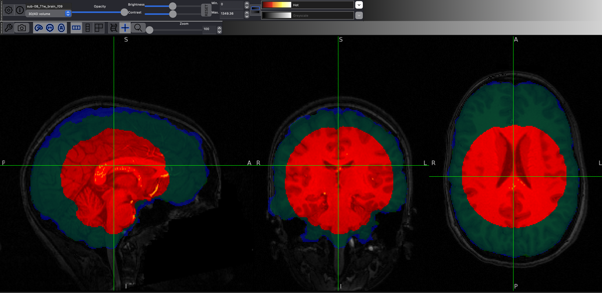
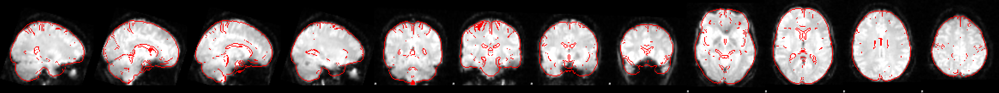
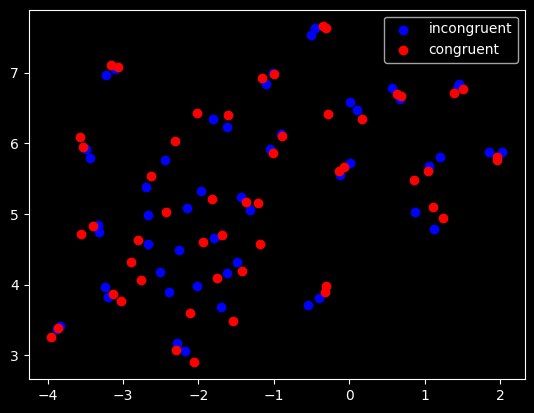

# [Andy's Brain Book](https://andysbrainbook.readthedocs.io/en/latest/index.html)

## Prereqs

(https://andysbrainbook.readthedocs.io/en/latest/fMRI_Short_Course/fMRI_01_DataDownload.html#fmri-01-datadownload)

Download the aws CLI then to get the sample data:

```bash
sh download.sh
```

## Notes

### UNIX

[`unix/`](./unix/)

- This is all review, nevertheless, doesn't hurt to go over again
- `>` refers to using stdout to put to another file
- `>>` will append not overwrite
- `|` pipe just takes the output from another program into stdin, then runs the subsequent program
- [sort](./unix/sort.sh)
- [for](./unix/for.sh)
- [if](./unix/if.sh) https://www.gnu.org/software/bash/manual/html_node/Bash-Conditional-Expressions.html
- `du -sh *` gives disk usage for all files
- `?` for single character wildcard, `*` for match all
- [awk](./unix/awk.sh)

### FSL

[`fsl/`](./fsl/)

- Flanker Task
 	- Subject sees the below, then says for each one whether pointing right or left.
	- `>>>>>>>>>>>>>>>`
	- `>>>>>>><>>>>>>>`
	- Note that some are congruent with all arrows (same direction)
	- Others are not congruent, like the second example (middle is different than surrounding)
	- You'd think that incongruent response times would be more
- Fixation in middle, then shown for 2s the stimuli, subject presses the left or right button. Then rest interval between (between 8 and 14 seconds).
- Goal test the BOLD difference between congruent and incongruent
- Open up a .nii.gz with `fsleyes filename.nii.gz`
- (sub-08) BET, choose a value 0 to 1. Lower means will attempt to label more as brain, higher means more as skull. Once you click finish will generate `_brain` version of the same file. can load both in FSLEyes and overlay the stripped version in blue. Make sure that we don't label too little as brain. Aim for perfect, but slightly more is better than less. . In the figure, red is 0.9, green is 0.1, and blue (best) is 0.1 for this particular subject.
- Next steps (motion correction and more) with FEAT. First click preprocessing, then select the functional data and which data to output. If the subject moves, we want to correct this so that voxels stay in the same spot. Apparently smoothing helps with removing noise. Then we can register the functional with an affine transform to the structural, then affine again to the standard space MNI152. After press go, brings up web page.  shows in red the functional mapped to the MNI standard space. Pretty darn good!
- Review up to this point: first get the stuff you want to study: the brain. To do that we strip the anatomical image of the skull and just keep the brain. We can do this with the FSL BET software. 0.5 on the BET scale is the middle, 0 is label more as brain, 1 is label more as skull. A good number for our case was 0.2, but make sure that we don't miss out on brain regions. Why do skull stripping only on anatomical and not the functional? Because skull shows up more in anatomical and we end up mapping the functional to the anatomical anyway. Next, the subject might have moved, so we need to align the voxels. We can do that in FSL FEAT and with MCFLIRT. To make the scans more accurate in time, can also correct for slice timing. To further reduce noise and better much up with the standard space, we also smooth over the functional data. Then, we register the data with the anatomical. This transform the functional image to anatomical space. Then we transform the anatomical to MNI space. This gives us a function that goes from function to MNI. It also gives us MNI to functional which is nice when we want to identify regions of the brain that have already been labeled. We use registration in FEAT with 12 degrees of freedom which notates an affine transformation.  .mat files have matrices where when we matmul with the data we transform the data into that space.
-  opening within the run the filtered_func_data.nii.gz is the final result output of the given functional data. This is in standard space and is where we do the analysis. The first three dimensions are x,y,z and the final is the time dimension during the run.
- We call a single voxel over time a time course
- before MRI was PET which requires taking a tracer that seeps into neurons and can measure activity. FMRI on the other hand measures blood oxygen signal differences. Where a neuron becomes more active, requires more oxygen, so we can measure that.
- To model directly the neural response form the fMRI data, we take the theoretical function for a given instantaneous response (HRF) and optimize parameters for that function given the data. If there are multiple responses or the stimuli is shown for more than just in instant, we insert the HRFs at each location. This can be easily done with a convolution. It will essentially place the single HRF in multiple locations.
- We can then learn these weights though GLM. Which essentially tries to explain the given data the best it can given a number of regressors (betas). For example in the case of congruent for incongruent, we can first define the impulses for congruent lets say as $X_1$ then for incongruent lets as as $X_2$,  (note both Xs are convolved with different HRF) then we can have two regressions as $Y = \beta_1 X_1 + \beta_2 X_2$. The first beta will try to explain the congruent response and the second beta will try to explain the incongruent response. Together trying to explain the measured fMRI found.
- To know when stimuli are shown, we can use the timing file. Needs to have onset (relative starting point since scan started), duration (how long stimulus), and parametric modulation (1 since we didn't do this for our dataset).
- Then open FEAT and do statistics instead of preprocessing. Select the run with FEAT, then go ahead and do full model setup. Here you can add explanatory variables (EVs) which are just the betas. Then in F tests we can do the contrasts to contrast the explanatory variables. For our data have 3 column format and in this case to simplify we remove temporal derivative.   
- To automate this for all subjects, use the .fsf file which contains the whole config and run that. Will need to do some replacements though. And the video recommends redoing the whole run with full analysis then saving the output and using those .fsf files.
- The betas are in the stats file with `pe` and contrast with `cope`
- Plotting the betas for all the subjects across runs with UMAP, I get . Probably could get better results if I reduce down further with 3D convolutions with an autoencoder, but I'll not get stuck in that rabbit hole for now. 
- Just to review the first level analysis, here we just look at time courses (voxel over time), but estimate the true BOLD signal with GLM. The GLM takes a given HRF with a parameter $\beta$, and tries to explain the given data. The summation over regressors makes up the entire GLM. Once we have some estimates, we have essentially compressed the (X,Y,Z,T) into (X,Y,Z) for each beta. In our case we have a beta for the incongruent example and one for the congruent. Then we can analyze the contrast which is the incongruent betas minus the congruent betas. If we want to do a t statistic so we have a tmap showing which voxels are significant, we can divide by the standard error, and we can also get which values are below the p threshold if we want. But these are just for each subject, what about if we want to average them all to get a result we can generalize for our subjects? Next step in second level analysis!
- First do Feat_gui then do higher level analysis. In our case we have 26 EVs for 26 subjects. We have 2 runs per subject, so notate with 1s that we average those into one betas map per subject. To get the full path do `ls -d $PWD/sub-??/run* | pbcopy` then copy into the select feat directories
- We use fixed effects to just use the average. Then put 1 in diagonal for the contrasts, and run go. This will contrast each of the subjects.
- Next we want to make a statement about the entire group. Here we could do an average, but there are other types of models. We will use the FLAME. Then pick model setup wizard and just use single group because we will be using them all together. Then go to post stats and choose the threshold for the final output. 
- I'm getting weird results so may have to redo the analysis