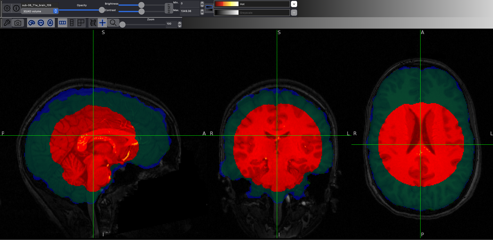

# [Andy's Brain Book](https://andysbrainbook.readthedocs.io/en/latest/index.html)

## Prereqs

(https://andysbrainbook.readthedocs.io/en/latest/fMRI_Short_Course/fMRI_01_DataDownload.html#fmri-01-datadownload)

Download the aws CLI then to get the sample data:

```bash
sh download.sh
```

## Notes

### UNIX

[`unix/`](./unix/)

- This is all review, nevertheless, doesn't hurt to go over again
- `>` refers to using stdout to put to another file
- `>>` will append not overwrite
- `|` pipe just takes the output from another program into stdin, then runs the subsequent program
- [sort](./unix/sort.sh)
- [for](./unix/for.sh)
- [if](./unix/if.sh) https://www.gnu.org/software/bash/manual/html_node/Bash-Conditional-Expressions.html
- `du -sh *` gives disk usage for all files
- `?` for single character wildcard, `*` for match all
- [awk](./unix/awk.sh)

### FSL

[`fsl/`](./fsl/)

- Flanker Task
 	- Subject sees the below, then says for each one whether pointing right or left.
	- `>>>>>>>>>>>>>>>`
	- `>>>>>>><>>>>>>>`
	- Note that some are congruent with all arrows (same direction)
	- Others are not congruent, like the second example (middle is different than surrounding)
	- You'd think that incongruent response times would be more
- Fixation in middle, then shown for 2s the stimuli, subject presses the left or right button. Then rest interval between (between 8 and 14 seconds).
- Goal test the BOLD difference between congruent and incongruent
- Open up a .nii.gz with `fsleyes filename.nii.gz`
- (sub-08) BET, choose a value 0 to 1. Lower means will attempt to label more as brain, higher means more as skull. Once you click finish will generate `_brain` version of the same file. can load both in FSLEyes and overlay the stripped version in blue. Make sure that we don't label too little as brain. Aim for perfect, but slightly more is better than less. . In the figure, red is 0.9, green is 0.1, and blue (best) is 0.1 for this particular subject.
